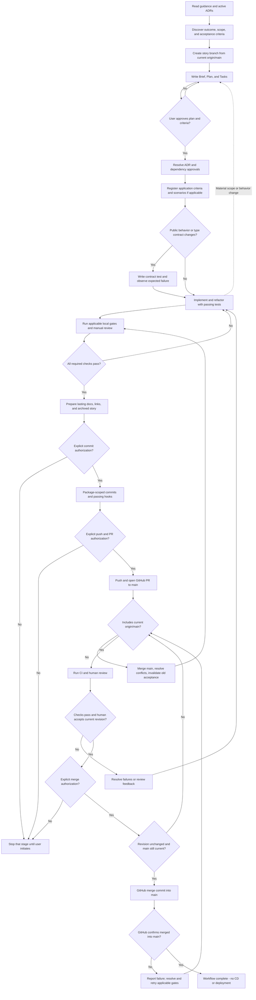

# ADR-0006: Workflow

## Context

Glacier's decisions and engineering notes already define architecture, dependency approval, testing, local checks,
and story traceability. Contribution skills define branching, package-scoped commits, and PR publication. Contributors
need a cohesive sequence with explicit handoffs, failure paths, and a common definition of completion.

Proportionate stories for every repository change are chosen over a separate small-change fast track. One branch per
story isolates work without creating a branch for every task. Public-contract test-first development is required for
public behavior changes, rather than imposing artificial failing tests on documentation or behavior-preserving refactors.
Human acceptance may include maintainer self-review so a solo maintainer is not blocked by an independent-reviewer rule.
Merge commits preserve package-scoped Conventional Commits, unlike squashing a multi-package story into one commit.

The story document model and its authoring skills are defined by [ADR-0008](ADR-0008-Story-documentation.md).
Fresh task workers and explicit execution waves separate implementation ownership from orchestration and make
parallelism conditional on demonstrably independent scopes rather than task count alone.

This workflow ends when GitHub confirms the PR merged into `main`. Releases, deployments, and continuous delivery are
outside its scope.

## Decision

### Stories and documentation

Story meaning, document ownership, stable IDs, task statuses, approval records, and the story documentation skills
are defined by [ADR-0008](ADR-0008-Story-documentation.md). The gates below apply to every story.

### Discover and approve

- Every repository change, including documentation, tests, dependencies, tooling, fixes, and refactoring, must belong
  to a story with `Brief.md`, `Plan.md`, and `Tasks.md`. Detail must be proportionate to risk and scope.
- Before editing, contributors must read the project guidance, relevant documentation, and every accepted, active ADR.
  They must inspect existing behavior and resolve intended outcomes, scope, acceptance criteria, and material unknowns
  with the user rather than infer requirements from implementation.
- Discovery and implementation planning must precede implementation. The ideation-grilling and planning-grilling
  skills must be used when needed to resolve uncertainty, not as mandatory interviews for already-settled decisions.
- The plan must identify affected packages/interfaces, dependencies, sequencing, risks, validation, and relevant
  migration needs. Every plan must retain the `E2E tests` section required by
  [ADR-0007](ADR-0007-Acceptance-catalog.md), including justified inapplicability for work without
  application/service feature changes.
- The user must explicitly approve the plan and acceptance criteria before implementation. Approval must not authorize
  commits, publication, or merging. New direct dependencies must receive explicit approval under ADR-0001; conflicts
  with accepted ADRs must be resolved by revising the approach or explicitly approving an update to the existing ADR
  before introducing the conflicting change.

### Isolate the story

- The explicitly user-approved documentation-only story `agent-task-orchestration` must exceptionally share
  `feature/glacier-reflection` on 2026-10-04. This exception must not authorize branch switching, changes to the
  existing dirty reflection `Tasks.md`, or general sharing of unrelated story branches. Its approval must be recorded
  in that story's plan; remaining authorization gates must stay intact.
- Before the first repository edit, including story documents, contributors must create one story branch from freshly
  fetched `origin/main`. Read-only discovery may precede branch creation. Subsequent tasks of the same story must reuse
  that branch; unrelated stories must not share it.
- Branch names must use `feature/<short-description>` for new behavior or capabilities, `bugfix/<short-description>`
  for correcting broken behavior, or `chore/<short-description>` for documentation, configuration, maintenance, and
  other non-feature work, with a lowercase kebab-case description. Contributors must not make story changes directly on `main`.
- Contributors must inspect working-tree state and branch availability before switching. Conflicting or unrelated
  work must be resolved with the user; it must not be silently stashed, discarded, moved, or included. Missing base
  refs or an existing intended branch name must be resolved explicitly, not replaced with an arbitrary base or branch.

### Implement and verify

- Main agents executing stories must use `implementation-develop`: discover current open stories read-only and ask
  the user which to execute even if only one exists. Archived unfinished work must be surfaced separately, not
  represented as delivered. Approved requirements, plan, branch state, and a complete acyclic task sequence must be
  verified before dispatch.
- Main agents must remain orchestration-only: read-only inspection, user clarification/approval requests, dispatch,
  coordination, and concise worker-report evaluation. They must never author code, tests, fixes, or directly edit
  repository files during execution. Documentation, evidence/status updates, checks, fixes, closure, and authorized Git
  operations must be delegated to bounded workers. Missing skills or delegation must block execution, not authorize
  a main-agent implementation fallback.
- Every task execution attempt, including retries and recovery, must receive a new worker/context; workers must not
  be reused for another task or recursively delegate. Prompts must identify task IDs, sources/criteria, approved
  design, dependencies and evidence, exact allowed write paths/resources, applicable skills, checks, and stop/failure
  policy. Workers must not expand scope or perform unapproved Git operations.
- Before dispatch, main agents must check prerequisite completion and wave readiness. Waves must follow ADR-0008's
  explicit sequence with exact worker counts. Only ready tasks with independent file/resource scopes must run in
  parallel. Global gates, manifests/lockfiles/root exports, shared documentation, and mutable resources must serialize
  unless demonstrably isolated. Shared Tasks evidence must have one writer: serialize an evidence worker or task-worker
  updates, never concurrent writes. Whole-wave barriers must be permitted.
- Human gates must wait with zero workers; main agents must not approve on the user's behalf. Once authorized, a fresh
  worker must verify/record the gate and perform only its separately authorized actions. Main agents must wait for
  relevant reports, block dependents after failure, and dispatch fresh recovery attempts preserving stable task IDs
  and attempt evidence. Runtime limitations may reduce concurrency through an explicit worker-authored sequence
  revision, not increase it unsafely. Material design changes must return to approval.
- Approved application/service criterion changes and required scenarios must enter
  [ADR-0007](ADR-0007-Acceptance-catalog.md)'s acceptance catalog before feature implementation. The story must
  preserve approved IDs, proposal rationale, and intended test paths.
- Every change to publicly accessible application UI, public HTTP behavior, or library package-root API behavior must
  follow strict test-first development: write or update a meaningful public-contract test, run it and observe the
  expected contract failure, implement the behavior, then refactor with passing tests. Application/service tests must
  use Playwright; library runtime tests must use Vitest through public exports; type-only API changes must use failing
  type-contract checks. Missing tooling, startup failures, or unrelated errors must not count as the expected failure.
- For removals, contributors must obtain approval of the changed requirement first and test the intended resulting
  public contract; merely deleting the old test must not satisfy test-first development. Behavior-preserving internal
  refactors, documentation, and tooling must retain applicable verification without requiring artificial red tests.
- Contributors must keep tasks and documentation current, preserve unaffected regression criteria, and verify error,
  authorization, and boundary behavior where applicable. Behavioral or material scope/design changes must return to
  the relevant approval gate; implementation corrections preserving the approved plan and behavior must not require
  repeated plan approval.
- Before requesting final review, applicable local pnpm/Turborepo lint, formatting, type-check, build, library coverage,
  catalog validation, and complete uncached Playwright checks must pass under ADR-0001 through ADR-0005 and
  ADR-0007. Focused runs provide development feedback only. Skips, concealed failures, and retry-only passes must not satisfy acceptance.
- Failed or unavailable applicable gates must block acceptance until the cause is resolved. Contributors must justify
  genuinely inapplicable checks and must not describe unavailable tooling as a successful check. Bootstrap work must
  establish and demonstrate its applicable gates. Documentation-only work must verify ADR conformance, consistency,
  and changed links without claiming code checks ran.
- Contributors must manually review requirements not established by automated checks, including architecture
  boundaries, all active ADRs, dependency approval, assertion quality, public contracts, and documentation.

### Commit and publish

- After implementation and required local verification, contributors must obtain explicit authorization to commit.
  Each commit must follow the implementation-commit skill: one declared package name or `workspace` scope, an
  appropriate Conventional Commit type, and breaking-change markers where applicable. Changes owned by different
  packages and workspace changes must be committed separately, without unrelated files.
- Applicable Husky/lint-staged pre-commit checks must pass. Contributors must resolve violations, stage corrections,
  and retry; they must not bypass failed checks or treat them as substitutes for workspace validation or CI.
- After committed work is ready, contributors must obtain separate explicit authorization to push and open a GitHub PR
  targeting `main`. The PR must describe the change, link its story, identify validation and applicable limitations,
  and make relevant architectural, dependency, and behavioral changes visible. Publication must not authorize merging.
- If the user declines publication, contributors must stop that stage without pushing or opening a PR and must not
  resume or ask repeatedly unless the user initiates it. Publication failures must be reported, not presented as success.

### Review and merge

- Applicable GitHub Actions builds, lint/format checks, tests, and Snyk scans must pass independently of local hooks.
  Findings requiring resolution, failed checks, and blocking review feedback must be resolved before merge.
- A human must explicitly accept the current PR revision, reviewing the approved criteria, meaningful assertions,
  all active ADRs, dependency approvals, and documentation. Maintainer self-review must be permitted; AI review must
  remain optional assistance rather than a substitute for human acceptance.
- Before final validation and merge, the story branch must include current freshly fetched `origin/main`. If it does
  not, contributors must merge that ref into the story branch, resolve conflicts without weakening approved behavior,
  and repeat required local checks and CI. Published history must not be rewritten by rebasing.
- Any new PR change, including conflict resolution or main integration, must invalidate acceptance and merge approval
  of the previous revision. Required checks and human acceptance must be renewed for the updated revision. Contributors
  must check freshness again before merging; another main update must repeat the integration and verification loop.
- Contributors must obtain explicit merge authorization after human acceptance and passing checks for the current
  revision. If that revision remains unchanged, one explicit human decision may express both acceptance and merge
  authorization; earlier implementation, commit, or publication approval must not substitute for it.
- The PR must be merged into `main` using GitHub's merge-commit method, preserving the individual package-scoped
  commits. Contributors must verify GitHub reports the PR as merged into `main`; a failed merge attempt, closed PR,
  green checks, or approval alone must not be reported as workflow completion.

### Prepare closure and adopt

- Before final review, the PR must include lasting documentation updates, completed implementation/verification tasks,
  links to implemented tests and catalog entries where applicable, and the story moved to `Archive/`. Affected indexes,
  relative links, and catalog source references must be updated without changing stable IDs.
- Archived story notes must distinguish pre-merge readiness from confirmed delivery. The final merge task must remain
  pending until GitHub confirms the merge; the archival location must not imply delivery. No follow-up documentation
  commit must be required solely to mark this confirmation.
- New work must follow the complete workflow. In-flight work must follow its remaining gates without fabricating
  historical branches, approvals, or test-first evidence. The workflow must stop at confirmed GitHub merge; release,
  deployment, and continuous-delivery steps must not be added to its completion criteria.
- Existing story documents must adopt the detailed contracts when their ongoing work is revised, recording genuine
  remaining obligations and available evidence. Completed historical notes and illustrative examples must not require
  a bulk rewrite or fabricated approval, task, or verification history.

### Workflow diagram

The diagram summarizes the gates; updates to an already published PR still require authorization to commit and push,
but must reuse the same story, branch, and PR rather than create another PR.

## Consequences

Fresh bounded workers cost additional dispatch and serialized evidence coordination. Explicit waves expose safe
parallelism and human waits; unavailable delegation blocks progress rather than weakening ownership.

Every change has an approved purpose, traceable verification, and explicit human handoffs. One story branch and
merge-commit history preserve both review context and package-level change attribution. Public-contract test-first
development supplies evidence that the new test detects the intended behavior change.

Stories, repeated full-stack checks, current-main integration, and renewed acceptance add coordination and runtime cost.
Main advancing during final review can delay a merge. Missing tooling, external dependencies, unresolved security
findings, and flaky tests can block code acceptance rather than justify bypasses.

The policy is procedural until scaffolding provides the required tools and GitHub enforcement. It adds no automation
or dependencies. In-flight work adopts remaining gates without rewriting its history. Archiving prepares the PR for
closure but does not itself establish that the change was delivered.

## Related notes

- [Architecture decisions](Index.md)
- [ADR-0001: Techstack](ADR-0001-Techstack.md)
- [ADR-0002: Package architecture](ADR-0002-Package-architecture.md)
- [ADR-0003: Code style](ADR-0003-Code-style.md)
- [ADR-0004: React conventions](ADR-0004-React-conventions.md)
- [ADR-0005: Testing strategy](ADR-0005-Testing-strategy.md)
- [ADR-0007: Acceptance catalog](ADR-0007-Acceptance-catalog.md)
- [ADR-0008: Story documentation](ADR-0008-Story-documentation.md)
- [Engineering guidelines](../../Engineering/Guidelines/Overview.md)
- [CI](../../Engineering/CI/Overview.md)
- [Stories](../../Stories/Index.md)
- [Archive](../../Archive/Index.md)
